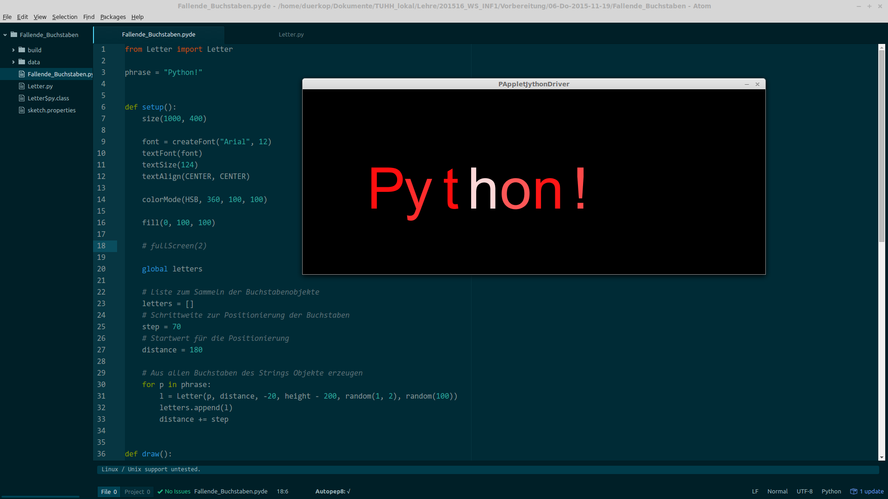

## Nerdkram

### Sketche mit Atom schreiben

[Atom](https://atom.io/) ist ein feiner Editor, der plattformübergreifend für verschiedenste Zwecke genutzt werden kann. Für das Schreiben von Processingsketchen liegen schon einige Packages vor, die jedoch nur für die Java-Variante taugen. Das Package [processing](https://github.com/bleikamp/processing) von [bleikamp](https://github.com/bleikamp) dient als Grundlage für die folgenden Arbeitsschritte, da es leicht angepasst werden kann.



### Processing.py für die Kommandozeile installieren

Processing.py-Sketche werden aus Atom über die Kommandozeile gestartet. Dazu muss der Python-Mode heruntergeladen werden. Das entsprechende Repo findet sich bei [Github](https://github.com/jdf/processing.py). In dem Ordner befindet sich das Shellskript `processing-py.sh`. Mit `chmod +x` muss es ausführbar gemacht werden. Sketches werden nun mit folgendem Befehl gestartet:

```bash
processing-py.sh mein-sketch.pyde
```

Damit das funktioniert, muss eine Datei mit Namen `processing-py.jar` im selben Ordner liegen. Diese wird mit `ant jar` erstellt. Dazu müssen `ant` und `antlr` installiert sein. Außerdem müssen `processing` und `processing-video` neben dem Verzeichnis `processing-py` liegen. Beide Projekte sind auch bei Github zu finden. Weitere Informationen zu diesem Vorgang finden sich bei [Github](https://github.com/jdf/processing.py/issues/96).

Während des Buildprozesses wird eine JRE-Datei von Oracle heruntergeladen. Hierbei kann es zu Problemen kommen, die durch manuelles Laden der Datei behoben werden können. Die URL wird in der Fehlermeldung angezeigt. Die Datei muss anschließend in einem zu erstellenden Ordner `linux` im Ordner `processing.py` abgelegt werden.

Ist der Buildprozess gelungen, liegt die Datei `processing-py.jar` im Unterordner `work`. Von dort wird sie neben `processing-py.sh` verschoben. 

Nun sollte auf der Kommandozeile das Ausführen von `pyde`-Programmen möglich sein. Der Developer-Mode von Atom gibt Aufschluss über Fehler und Warnungen.

### Package anpassen

Um `pyde`-Programme aus Atom heraus ausführbar zu machen, muss das oben genannte Package von *bleikamp* geringfügig angepasst werden.

Die folgende Zeile in `lib/processing.coffee` muss verändert werden:

```coffee
args = ["--force", "--sketch=#{folder}", "--output=#{build_dir}", "--run"]
```

wird zu

```coffee
args = ["#{file.path}"]
```

Anschließend muss Atom neu geladen werden.

### Package konfigurieren

In den Einstellungen des Packages ist nun noch der Pfad zum Shellskript `processing-py.sh` zu hinterlegen. Ein Aufruf der Settingsseite in Atom mit `STRG + ,` und die Suche nach `processing` in den installierten Packages zeigt das Package von *bleikamp* an. In das Feld *Processing-executable* wird nun `processing-py.sh` eingetragen.

Anschließend sollte der Aufruf "Processing -> Run" über das Menü sowie über die Tastenkombination `STRG + ALT + B` möglich sein.

### Syntax Highlighting für .pyde

Um in Atom das Syntax Highlighting für `.pyde`-Dateien einzustellen, muss ein knapper Eintrag in der `config.json` ergänzt werden:

```
# Atom's config.json

"*":
  core:
    customFileTypes:
      "source.python": [
        "pyde"
      ]
```

Anschließend muss Atom neu geladen werden.