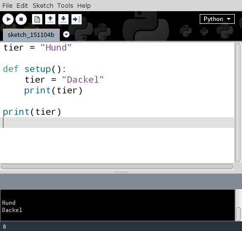

## Variablen

Um Daten in einem Programm verarbeiten zu können, muss man sie zunächst speichern können. Als Speicherorte dienen *Variablen*, denen Werte zugewiesen werden.

```{.python}
tier = "Dackel"
```

Auf der linken Seite des Gleichheitszeichens steht der Variablennamen, auch *Bezeichner* genannt, rechts davon der Wert. Hier wird der Variablen `tier` der String `"Dackel"` zugewiesen. Damit wird die Variable *definiert*.

Bezeichner sollten sinnvoll und selbstdokumentierend gewählt werden. Das heißt, dass der Name der Variablen Auskunft über den Sinn und die Verwendung des Werts geben sollte[^4]. In Python können alle Datentypen Variablen zugewiesen werden.


### Geltungsbereich von Variablen

Der Ort, wo eine Variable definiert wurde, entscheidet über ihren Geltungsbereich und damit über ihre *Sichtbarkeit* im Programm. Man unterscheidet *lokale* und *globale* Variablen[^5].

Dieses Konzept bringt einige Regeln mit sich, die zunächst kompliziert erscheinen mögen. Im Moment einer Zuweisung oder Definition werden Bezeichner in einem Namensraum verortet und sind nur dort gültig. Die Idee dahinter ist es, Ordnung zu schaffen und zu vermeiden, dass sich Namen gegenseitig stören und überschreiben können. Man kann sich das vielleicht vorstellen wie Räume in einem Gebäude.

Das folgende Beispiel zeigt die Definition einer lokalen Variablen:

```python
def setup():
    tier = "Igel"
    text(tier, 30, 30)
```

In der Funktion `setup()` wird der Variablen `tier` der String `"Igel"` zugewiesen. Damit ist der Geltungsbereich von `tier` lokal auf die Funktion beschränkt. Die Ausführung des Programms funktioniert, es wird der Inhalt der Variablen als Text auf die Leinwand gezeichnet.

Durch das Konzept der Namensräume in Python ist es möglich, zwei verschiedene Variablen mit gleichem Namen zu definieren:



Die Ausgabe auf der Konsole zeigt, dass die Geltungsbereiche der Variablen unterschiedlich sind. Die Zuweisung von `"Dackel"` an `tier` innerhalb von `setup()` überschreibt nicht die Variable außerhalb der Funktion. Der Geltungsbereich von `tier = "Hund"` ist in diesem Beispiel *global*, der von `tier = "Dackel"` *lokal* auf den Geltungsbereich der Funktion beschränkt.

Wie sich die lokale Beschränkung des Geltungsbereichs in anderen Zusammenhängen auswirkt, zeigt das folgende Beispiel:


In der Funktion `draw()` wird versucht, auf die Variable `tier` zuzugreifen. Bei Ausführung des Programms wird ein Fehler geworfen:

        NameError: global name 'tier' is not defined
        
Der Python-Interpreter sucht zunächst lokal, also innerhalb der Funktion `draw()` nach `tier`. Da er die Variable dort nicht findet, geht er davon aus, dass sie global verfügbar ist. Das ist aber auch nicht der Fall, sodass er zu dem Schluss kommt, dass sie noch nicht definiert wurde.

Was bedeutet aber *global verfügbar*? Variablen sind dort gültig, wo sie definiert wurden. Werden sie folglich außerhalb von Funktionen definiert, ist ihr Geltungsbereich *global*.

Das folgende Beispiel macht `tier` global verfügbar:

```python
tier = "Igel"

def setup():
    text(tier, 30, 30)
    
def draw():
    text(tier, 30, 80)
```

`tier` wird außerhalb aller Funktionen definiert und steht damit für **lesenden Zugriff** in allen Bereichen des Programms zur Verfügung.

Oft kommt es allerdings vor, dass Variablen zur Laufzeit des Programms ihren Wert ändern sollen. Es soll also **schreibend** auf die Variable zugegriffen werden. Aus dieser Anforderung folgen neue Regeln:


Hier wird versucht, den bisherigen Inhalt von `tier` zu verändern, indem noch ein weiterer String angehängt wird. Der entstehende String `"Igelstacheln"` soll dann der Variable `tier` wieder zugewiesen werden. Der Interpreter steigt mit einer Fehlermeldung aus:

        UnboundLocalError: local variable 'tier' referenced before assignment
        
Auf Deutsch heißt das: Auf die lokale Variable `tier` wurde zugegriffen, bevor sie definiert wurde. `tier + "stacheln"` funktioniert noch, die Zuweisung an `tier` scheitert dann aber, weil `tier` lokal nicht definiert wurde **und** Python immer versucht, die Variable im *lokalen* Geltungsbereich zu erstellen oder zu ändern, es sei denn, sie wurde als *global* deklariert (vgl. Lutz 2013, S. 488).  

Um das letzte Beispiel zum Laufen zu bringen, ist folgendes möglich:

```python
tier = "Igel"

def setup():
    global tier
    tier = tier + "stacheln"
    text(tier, 10, 30)
    
def draw():
    text(tier, 10, 80)
```

Mit der Deklaration von `tier` als globale Variable ist auch der Schreibzugriff möglich. Das Ergebnis auf der Leinwand zeigt nun zweimal die `"Igelstacheln"`, da der Wert der Variablen nicht lokal, sondern global geändert wurde.

### Zusammenfassung

Zusammenfassend können folgende Regeln formuliert werden:

* Variablen, die in einer Funktion definiert wurden, sind auch nur sichtbar in dieser Funktion. Ein Zugriff von außen auf diese Variablen ist nicht möglich.
* Variablen, die innerhalb einer Funktion definiert wurden, kollidieren nicht mit Variablen gleichen Namens, die außerhalb oder anderweitig existieren.
* Wenn eine Variable außerhalb aller Funktionen definiert wurde, ist sie global im Bezug auf die gesamte Datei[^6].
* Python sucht nach Namen **von innen nach außen**. Das heißt, es wird immer erst geschaut, ob ein Name lokal vorhanden ist, dann ob er global vorhanden ist. Findet Python den Namen, hört die Suche auf.


---


[^4]: Vgl. Passig (2013) zur qualvollen Suche nach dem richtigen Bezeichner

[^5]: Auf die Erklärung von *nicht-lokalen* Variablen wird hier verzichtet. Vgl. hierzu Lutz (2013, S. 485 ff.)

[^6]: Über Dateien können weitere Namensräume voneinander abgegrenzt werden. Vgl. hierzu auch Lutz (2013)