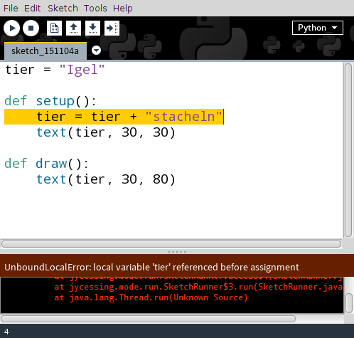

## Variablen

Um Daten in einem Programm verarbeiten zu können, muss man sie zunächst speichern können. Als Speicherorte dienen *Variablen*, denen Werte zugewiesen werden.

```{.python}
tier = "Dackel"
```

Auf der linken Seite des Gleichheitszeichens steht der Variablennamen, auch *Bezeichner* genannt, rechts davon der Wert. Hier wird der Variablen `tier` der String `"Dackel"` zugewiesen. Damit wird die Variable *definiert*.

Bezeichner sollten sinnvoll und selbstdokumentierend gewählt werden. Das heißt, dass der Name der Variablen Auskunft über den Sinn und die Verwendung des Werts geben sollte[^4]. In Python können alle Datentypen Variablen zugewiesen werden.


### Geltungsbereich von Variablen

Der Ort, wo eine Variable definiert wurde, entscheidet über ihren Geltungsbereich. Man unterscheidet *lokale* und *globale* Variablen.

Das folgende Beispiel zeigt die Definition einer lokalen Variablen:

```python
def setup():
    tier = "Igel"
    text(tier, 30, 30)
```

In der Funktion `setup()` wird der Variablen `tier` der String `"Igel"` zugewiesen. Damit ist der Geltungsbereich von `tier` lokal auf die Funktion beschränkt. Die Ausführung des Programms funktioniert, es wird der Inhalt der Variablen als Text auf die Leinwand gezeichnet.

Wie sich die lokale Beschränkung des Geltungsbereichs auswirkt, zeigt das folgende Beispiel:


In der Funktion `draw()` wird versucht, auf die Variable `tier` zuzugreifen. Bei Ausführung des Programms wird ein Fehler geworfen:

        NameError: global name 'tier' is not defined
        
Der Python-Interpreter sucht zunächst lokal, also innerhalb der Funktion `draw()` nach `tier`. Da er die Variable dort nicht findet, geht er davon aus, dass sie global verfügbar ist. Das ist aber auch nicht der Fall, sodass er zu dem Schluss kommt, dass sie noch nicht definiert wurde.

Was bedeutet aber *global verfügbar*? Variablen sind dort gültig, wo sie definiert wurden. Werden sie folglich außerhalb von Funktionen definiert, ist ihr Geltungsbereich *global*.

Das folgende Beispiel macht `tier` global verfügbar:

```python
tier = "Igel"

def setup():
    text(tier, 30, 30)
    
def draw():
    text(tier, 30, 80)
```

`tier` wird außerhalb aller Funktionen definiert und steht damit für **lesenden Zugriff** in allen Bereichen des Programms zur Verfügung.

Oft kommt es allerdings vor, dass Variablen zur Laufzeit des Programms ihren Wert ändern sollen. Es soll also **schreiben** auf die Variable zugegriffen werden. Aus dieser Anforderung folgen neue Regeln:




[^4]: Vgl. Passig (2013) zur qualvollen Suche nach dem richtigen Bezeichner