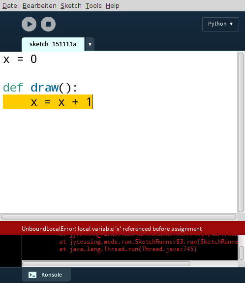

## Funktionen


Funktionen machen es möglich, eine Reihe von Anweisungen mehrfach auszuführen. Damit kann vermieden werden, dass derselbe Code mehrfach geschrieben oder gar mit *copy and paste* vervielfältigt wird. Dieses Konzept ist nicht nur ein Merkmal von Python, auch in anderen Sprachen sind Funktionen zu finden. Funktionen können auch aus Daten neue Daten berechnen und stellen ein wesentliches Werkzeug für die Strukturierung von Programmen zur Verfügung.

### Eingebaute Funktionen

In den vorherigen Kapiteln sind schon einige Funktionen verwendet worden, die in Python eingebaut sind oder die von Processing für Python zur Verfügung gestellt werden.

```python
# Beispiele für Processing-Funktionen, die mit Python verwendet werden können.

size(200, 300) # Funktion für die Definition der Leinwandgröße
print(x) # Funktion zur Ausgabe von Daten auf der Konsole
```

Weitere Funktionen sind auf der Referenzseite von [Processing ](http://py.processing.org/reference) einzusehen.

Häufig ist es so, dass die Funktionen einer Programmiersprache zwar eine Reihe von Standardaufgaben abdecken, komplexere Programme aber individuelle Lösungen und damit auch neue, individuelle Funktionen benötigen. Daher ist es auch in Python möglich, eigene Funktionen zu definieren und ihnen das gewünschte Verhalten "einzubauen".


### Eigene Funktionen definieren

Die Definition von Funktionen in Python ist denkbar einfach. Genaugenommen haben wir das bisher schon oft getan:

```python
# Einmalige Ausführung von Grundeinstellungen für das Programm
def setup():
    fullScreen()
    ellipseMode(CENTER)

# Wiederholte Ausführung (Endlosschleife)
def draw():
    ellipse(mouseX, mouseY, 50, 50)
```

Hierbei handelt es sich um zwei Funktionen, die, wenn sie definiert sind, beim Start eines Programms ausgeführt werden. Alle anderen Funktionen, die wir definieren, müssen ausdrücklich aufgerufen werden.

`mousePressed()` ist eine weitere Systemfunktion von Processing, mit der sich der Mausklick abfragen lässt:

```python
# Einmalige Ausführung bei Mausklick
def mousePressed():
    fill(random(255))
```

Mit dem Schlüsselwort `def` wird die *Definition* einer Funktion eingeleitet. Zusammen mit dem *Namen* der Funktion und möglichen *Parametern* bildet diese erste Zeile die *Funktionssignatur*. 

Eingerückt folgt dann der Code, der beim Aufruf der Funktion ausgeführt werden soll, der *Funktionsrumpf*. Er kann aus beliebig vielen Zeilen bestehen. Eine goldene Regel lautet:

<div class="box">
Eine Funktion kann zwar viele Zeilen Code enthalten. Sie sollte aber genau eine Aufgabe erledigen.
</div>

Da es möglich ist, beliebig viele Funktionen zu definieren, wächst deren Anzahl in einem Programm, wenn es komplexer wird. Der Name der Funktion ist frei wählbar, solange er den Regeln des [PEP 0008](https://www.python.org/dev/peps/pep-0008/#function-names) folgt. Neben den syntaktischen Anforderungen ist eine Sache sicherlich besonders hervorzuheben:

<div class="box">
Der Name der Funktion sollte aussagen, was die Aufgabe der Funktion ist. Daher ist `zeichne_kreuz()` aussagekräftiger als `kreuz()`. 
</div>

Im folgenden Beispiel wird eine Funktion definiert, die in alle vier Ecken der Leinwand einen Punkt zeichnet.

```python
def zeichne_eckpunkte():
    point(0, 0)
    point(width - 1, 0)
    point(0, height - 1)
    point(width - 1, height - 1 )
```

Die Ausführung des Programms zeigt kein Ergebnis. Es fehlt noch der *Aufruf* der Funktion.

```python
zeichne_eckpunkte()
```

Funktionen in Python existieren nur, wenn sie aufgerufen werden.

### Lokale und globale Variablen

Damit man Variablen *innerhalb* von Funktionen **ändern** kann, die *außerhalb* definiert wurden, müssen sie mit `global` für die jeweilige Funktion verfügbar gemacht werden. Andernfalls kommt es zu einer Fehlermeldung:



Mit `global` funktioniert die Aktualisierung von `x`:

```python
x = 0

def draw():
    global x
    x = x + 1
```

Die theoretischen Grundlagen für dieses Vorgehen werden im Kapitel [Variablen](../Programmiergrundlagen/2-variablen.md) genauer ausgeführt. 

### Lernvorschläge

1. Recherchiere die Regeln für Funktionsnamen in der Python-Dokumentation.
2. Probiere aus, wie Processing reagiert, wenn eine der beiden Funktionen `setup()` und `draw()` fehlen.
3. Probiere aus, was passiert, wenn der Aufruf einer Funktion vor ihrer Definition erfolgt.
2. Definiere eine Funktion, die in der Mitte der Leinwand einen Stern aus zwei Dreiecken zeichnet. Gib der Funktion einen sprechenden Namen.
3. Realisiere ein eigenes Malwerkzeug mithilfe einer Funktion.

### Empfohlene Videos zum Thema

* [Funktionen](https://www.youtube.com/watch?v=Uzb_ajpcMUo&feature=youtu.be&list=PLD20BEE125C1FC7B1) erklärt von [openscreencast](https://www.youtube.com/channel/UC_oJHQiMx9dNkbt2Wz9nicQ)