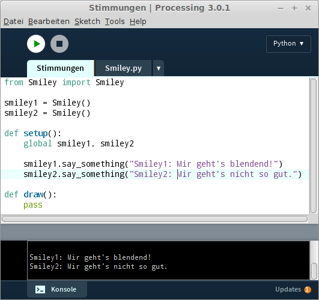

## Klassen erstellen mit *class*

Um selbst Objekte in Python (und auch anderen objektorientierten Programmiersprachen) zu erstellen, ist eine *Klasse* zu definieren. Diese erfüllt die Funktion eines *Bauplans*, aus dem konkrete Objekte erstellt werden können - die *Instanzen*.

Um mit Klassen in der Processing-IDE bequem arbeiten zu können, wird folgendes Vorgehen empfohlen:

### Klassen definieren

Zunächst erstellen wir in der Processing-IDE (Python-Mode) das Grundgerüst eines Processing-Sketches.

```python
def setup():
    pass
    
    
def draw():
    pass
```

Den Sketch speichern wir unter dem Namen `Stimmungen` ab.

Die Processing-IDE unterstützt die Verwaltung von Programmteilen wie Klassen oder Modulen durch Tabs am Kopf des Editorbereichs. Für das Smiley-Beispiel erstellen wir also einen neuen Tab und vergeben den Namen `Smiley`. Processing macht daraus den Dateinamen `Smiley.py`.


Im Dateisystem unseres Rechners wird das Projekt nun wie folgt abgebildet:


`Stimmungen.pyde` ist die Hauptdatei des Sketches, `Smiley.py` die Datei für unsere Klasse. Jetzt können wir beginnen, die ersten Zeilen für die Klasse `Smiley` zu schreiben.

```python
class Smiley:
    pass
```

Mit dem Schlüsselwort `class` gefolgt von einem bezeichnenden Substantiv beginnt die Definition. `pass` ist an dieser Stelle wieder nur ein Platzhalter für Code, der später folgt.

Unsere Klasse soll eine erste Eigenschaft in Form einer Funktion bekommen. Sind Funktionen Teil einer Klasse, spricht man von einer *Methode*.

```python
class Smiley:
    
    def say_something(self, something):
        print(something)
```

Methoden werden genauso wie Funktionen definiert - einziger Unterschied an dieser Stelle: Als Argument muss immer `self` übergeben werden. `self` steht für eine Instanz der Klasse `Smiley`. Dieses Konzept wird in Kürze deutlicher, wenn wir konkrete Objekte bzw. Instanzen aus der Klasse erstellen.

### Objekte erstellen

Da die Klassendefinition in einer eigenen Datei liegt, hat das Hauptprogramm keine Kenntnis von ihr. Daher müssen wir die Klassendefinition im Hauptprogramm *importieren*.

```python
from Smiley import Smiley

def setup():
    pass
    

def draw():
    pass
```

Die erste Zeile lässt sich so lesen: Aus der Datei `Smiley.py` importiere die darin enthaltene Klasse `Smiley`. Beachte, dass die Dateiendung nicht angegeben wird.

Nun haben wir Zugriff auf die Klasse und können ein erstes Objekt erstellen.

```python
from Smiley import Smiley

smiley1 = Smiley()

def setup():
    pass
    
def draw():
    pass
```

In der neuen Zeile wird der Variablen `smiley1` eine Instanz der Klasse `Smiley` zugewiesen. Das heißt konkret, dass unsere Klassendefinition als Bauanleitung genommen wurde, um daraus ein konkretes Objekt zu erstellen. Weil das so einfach geht, lassen wir uns gleich noch einen zweiten Smiley bauen.

```python
from Smiley import Smiley

smiley1 = Smiley()
smiley2 = Smiley()

def setup():
    pass
    
def draw():
    pass
```

Unser Smiley ist ja grundsätzlich mit einem minimalen *Können* ausgestattet: Er kann was sagen. Das können wir in unserem Code wie folgt abbilden:



In der Zeile 

```python
smiley1.say_something("Smiley1: Mir geht's blendend!")
```

rufen wir eine Methode des Objekts `smiley1` auf und übergeben ein Argument. Python sucht dann nach der Klasse, aus der das Objekt entstanden ist und darin nach der Methode. 