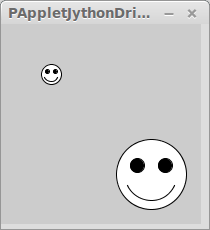

## Mehr Eigenschaften

Nachdem wir die grundlegenden Konzepte von Klassen hergeleitet haben, wollen wir dem Smiley nun mehr Gestalt geben. Dafür erweitern wir zunächst die Klassendefinition.

```python
# -*- coding: utf-8 -*-

class Smiley:    
    
    def say_something(self, something):
        print(something)
        
    def paint(self, x_pos, y_pos, size_xy):
        """ Malt einen Smiley auf Basis der übergebenen
        Argumente. Positionen von Augen und Mund werden
        aus den Parametern errechnet.
        """ 
        ellipseMode(CENTER)
        
        # Körper
        ellipse(x_pos, y_pos, size_xy, size_xy)
        
        # Füllfarbe setzen
        fill(0)
        # Auge links
        ellipse(x_pos - size_xy * .2, y_pos - size_xy * .12, size_xy * .2, size_xy * .2)
        # Auge rechts
        ellipse(x_pos + size_xy * .2, y_pos - size_xy * .12, size_xy * .2, size_xy * .2)
        
        # Mund
        noFill()
        arc(x_pos, y_pos, size_xy * .75, size_xy * .75, radians(25), radians(155));
        
        # Füllfarbe zurücksetzen
        fill(255)
```

Keine Angst vor dem bisschen Mathematik, es sieht schlimmer aus, als es ist. Im Grunde handelt es sich um Prozentrechung, um ausgehend von `size_xy` die Positionen von Augen und Mund korrekt berechnen zu können.

Im Hauptsketch können wir nun richtige Smileys auf die Leinwand zeichnen.

```python
from Smiley import Smiley

smiley1 = Smiley()
smiley2 = Smiley()


def setup():
    global smiley1, smiley2
    size(200,200)

    smiley1.paint(50, 50, 20)
    smiley2.paint(150, 150, 70)

def draw():
    pass
```

Das Ergebnis ist schon ganz passabel.



Im nächsten Schritt sollten wir uns darum kümmern, dem Smiley ein wenig mehr Farbe zu geben. Dabei soll es möglich sein, jedes Objekt unterschiedlich einzufärben. Die Farbgebung soll schon in dem Moment der Objekterzeugung erfolgen:

```python
# Änderung im Hauptprogramm
smiley1 = Smiley('#FFFF00') # gelb
smiley2 = Smiley('#0077FF') # blau
```

Damit das funktioniert, muss die Klassendefinition angepasst werden.

