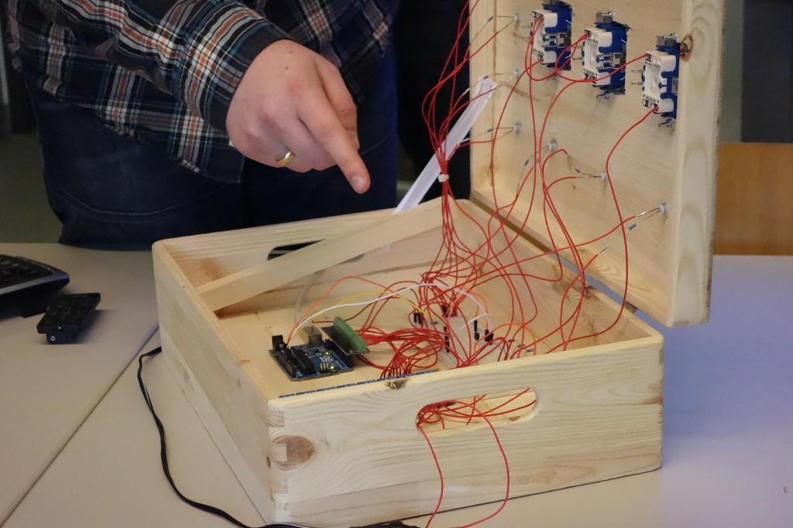

# Vorwort

Das vorliegende Buch entsteht aus der Erfahrung, die ich mit einer zweisemestrigen Einführungsveranstaltung zur Informatik gemacht habe. An der TU Hamburg-Harburg führe ich seit 2012 zukünftige Gewerbelehrer und -lehrerinnen in die Grundlagen der Programmierung ein und entwickle ihre Kenntnisse und Kompetenzen im Umgang mit Microcontrollern und Webtechnologien. Meine Veranstaltungen waren bisher erfolgreich und haben in jedem Jahrgang gute bis erstaunliche Ergebnisse hervorgebracht. Dazu beigetragen haben auch meine Tutorinnen und Tutoren, die die Veranstaltung begleiten und die Studierenden jede Woche bei ihren Aufgaben und Projekten unterstützen.

## Die Motivation für Python in der gewerblich-technischen Berufsbildung

Um die Motivation für den Ansatz *Python mit Processing lernen* zu erklären, will ich kurz die Rahmenbedingungen beschreiben. Die Teilnehmenden meiner Veranstaltung sind Studierende des 3. und 4. Fachsemesters in den Studiengängen Medientechnik und Elektrotechnik-Informationstechnik. Sie werden Berufschullehrende im gewerblich-technischen Bereich und wollen später Auszubildende medientechnischer und elektrotechnischer Berufe unterrichten. Dementsprechend groß sind die Anforderungen im weiten Feld der Informationstechnik.

In meiner Einführungsveranstaltung sitzen Studierende beider Fachrichtungen, die fast alle eine abgeschlossene Berufsausbildung oder ein Äquivalent vorweisen können. Sie kommen mit sehr unterschiedlichen Berufserfahrungen und auch ganz verschiedenen Blicken auf Technik und Informatik. Dieser heterogenen Gruppenkonstellation gerecht zu werden, ist und bleibt eine Herausforderung.

Um den beschriebenen Anforderungen entsprechen zu können, hatte ich als Ziel für die erste Hälfte der zweisemestrigen Veranstaltung folgende Ziele definiert:

* Die Studierenden kennen die Grundlagen der Programmierung einschließlich Objektorientierung und sind in der Lage, komplexere Probleme zu lösen.
* Sie können Daten von Sensoren eines Arduino Uno verarbeiten und angeschlossene Aktoren steuern.
* Sie können Daten mithilfe der Programmiersprache Processing visualisieren.

Dieser Ansatz hat sich als sehr erfolgreich erwiesen, da Processing und Arduino einen sehr einfachen Einstieg ermöglichen und schnell Erfolgserlebnisse zeitigen.

_**Abbildung:** Studentisches Projekt (Arduino/Processing/Java): Lernumgebung für auszubildende ElektronikerInnen in der Fachrichtung Energie- und Gebäudetechnik. Quelle: Axel Dürkop [(CC-BY)](https://creativecommons.org/licenses/by/4.0/)_

Den Einstieg in die Programmierung machten die Studierenden mit [Processing](http://processing.org) sowie der Arduino-IDE. Dabei erzielten sie schnelle Erfolge bei gleichzeitig geäußertem Spaß an der Sache.  

Im zweiten Semester sollen die Studierenden die Grundlagen moderner Webtechnologien erarbeiten und sich an einem ganzheitlichen Arbeitsprozess aus dem Bereich des Webdesigns abarbeiten. Folgende Ziele sind dafür formuliert worden:

* Die Studierenden kennen die Grundlagen von HTML5 und CSS/CSS3 und können sie für ein selbstgewähltes Projekt einsetzen.
* Die Studierenden können dynamische Webseiten mithilfe der Skriptsprache PHP erstellen.
* Sie kennen die Grundlagen der Serveradministration unter Linux und können ihr Webseitenprojekt unter Realbedingungen ins Netz bringen.
* Sie können Aktoren und Sensoren aus einer Webseite heraus ansteuern (Raspberry Pi).

An diesen Zielsetzungen war auch vieles gut, jedoch wurde der Wechsel von Processing/Arduino zu PHP im zweiten Semester als Bruch empfunden. HTML5 und CSS3 sind mittlerweile zu komplexen Konstrukten ausgewachsen, die den Studierenden viel abverlangen, sodass PHP in der verbleibenden Zeit nie in Gänze ausgeleuchtet werden konnte. Die Studierenden beschrieben oft, dass sie erst in den Semesterferien Zeit und Muße gefunden hatten, sich auf PHP einzulassen. Was fehlte, war eine semesterübergreifende Konstante, eine Sprache, auf die die Studierenden im zweiten Semester aufbauen konnten. PHP im ersten der beiden Semester machte keinen Sinn und Processing im zweiten auch nicht.

## Python und Processing vereint

Als PHP-Kenner und -Nutzer habe ich Python erst spät kennen und lieben gelernt. Mich hat immer das Web interessiert, und Python hatte ich lange nicht als Websprache wahrgenommen. Durch die Arbeit mit dem Raspberry Pi und den Auftritt des schlanken Webframeworks [Flask](http://flask.pocoo.org/) hat sich das geändert. Mir scheint, das Python gerade für die Zwecke, in denen meine Zielgruppe später agieren wird, eine bessere Wahl ist als PHP (vgl. Kapitel zu Einsatzbereichen von Python). Daher ist das Ziel meiner künftigen Lehrveranstaltung wie auch dieses Buchs, meine Studierenden früh an Python heranzuführen und dabei die guten und positiven Erfahrungen aus der Vergangenheit zu bewahren.  

## Dieses Buch, ein *Living Document*

Als ich die [Portierung von Processing auf JPython](https://github.com/jdf/processing.py) entdeckte, erschien es mir sofort möglich, diesen Plan durchzuführen. Das vorliegende Buch ist dafür die Grundlage. Es soll zum einen als Skript zur Veranstaltung dienen, zum anderen aber auch andere einladen, an dem Konzept mitzudenken und mitzugestalten. Die freie Lizenzierung und das offene Dateiformat sollen dazu beitragen. Ich gehe davon aus, dass die Kapitel eine Überarbeitung im Rahmen der durchgeführten Veranstaltung erfahren, aber auch durch *feature requests* und *pull requests* der Community, die sich mit ähnlichen Themen beschäftigt.
